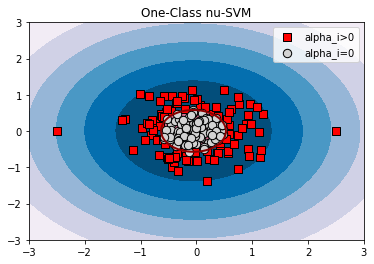

# One-Class SVM+

Unsupervised outlier detection with *privileged information*. Generalizes one-class *`nu`*-SVM that estimates the support of a high-dimensional distribution by accounting for additional (privileged) set of features available in the training phase but not available in evaluating and predicting new data (for example, future time series behavior). 

Along with the current SVM models, it solves dual optimization problem with respect to unknown coefficients with *Sequential Minimal Optimization*. SMO finds the two coefficients that violate Karush-Kuhn-Tucker conditions the most, and shifts them in opposite directions keeping their sum constant. The optimization procedure converges to a `tau` -approximate solution, which means that the KKT conditions are satisfied with the tolerance of `tau`.

# Installation
You can just download the repository to your folder. Then from its root directory (where `setup.py` is located) run on the command line

`python setup.py build_ext --inplace`

After that, you can import the library from Python:

`>>> import ocsvm_plus`

Make sure you are using Python 3.x (you may need "python3" instead of "python"). You will also need Cython installed (`pip install Cython` or similar). To be more confident, you should run unit tests:

`python setup_debug.py build_ext --inplace`<br/>
`python -m unittest tests`

Now debug version is also available:

`>>> import ocsvm_plus_debug`

The debug version performs assertions, obtains intermediate results in different ways and checks their equivalence, dumps more detailed info to the log file. It works much slower than basic (release) version.

# API

```python
class ocsvm_plus.OneClassSVM_plus(n_features, kernel='rbf', kernel_gamma='scale', 
                                  kernel_star='rbf', kernel_star_gamma='scale', 
                                  nu=0.5, gamma='auto', tau=0.001, 
                                  alg='best_step_2d', ff_caches='not_bound', 
                                  kernel_cache_size=0, distance_cache_size=0, 
                                  max_iter=-1, random_seed=None, 
                                  logging_file_name=None)
```

## Parameters

| **Parameters:**                                                                                              |  **Description**                                       |
| :-------                                                                                                     | :-------                                               |
| <strong>n_features: *int*</strong>                                                                           | Number of original features.                           |
| <strong>kernel: *{'rbf', 'linear'} or a class derived from ocsvm_plus.kernel, defailt='rbf'*</strong>        | Kernel K for original features `X`.                    |
| <strong>kernel_gamma: *{'scale', 'auto'} or float, default='scale'*</strong>                                 | Kernel coefficient if K is 'rbf'. For `kernel_gamma='scale'` (default) it uses `kernel_gamma=1/(n_features*X.var())` as value of `kernel_gamma`. For 'auto' it uses `kernel_gamma=1/n_features`. |
| <strong>kernel_star: *{'rbf', 'linear'} or a class derived from ocsvm_plus.kernel, defailt='rbf'*</strong>   | Kernel K* for privileged features `X_star`.            |
| <strong>kernel_star_gamma: *{'scale', 'auto'} or float, default='scale'*</strong>                            | Kernel coefficient if K* is 'rbf'. For `kernel_star_gamma='scale'` (default) it uses `kernel_star_gamma=1/(n_features_star*X_star.var())` as value of `kernel_star_gamma`. For 'auto' it uses `kernel_star_gamma=1/n_features_star`.     |
| <strong>nu: *float, default=0.5*</strong>                                                                    | Parameter of `nu`-SVM, original features regularizer, should be between (0, 1). |
| <strong>gamma: *'auto' or float, default='auto'*</strong>                                                    | Privileged features regularizer. For `gamma='auto'` it uses `gamma=nu*n_samples`. |
| <strong>tau: *float, default=0.001*</strong>                                                                 | Tolerance for stopping criterion.                |
| <strong>alg: *{'best_step_2d', 'best_step', 'delta_pair'}, defailt='best_step_2d'*</strong>                  | Mode for optimization procedure, affects processing time. For `'delta_pair'` the algorithm tries to find the most `delta`-violating pair of privileged coefficients and, if no `delta`-pairs remained, then it looks for `alpha`-violating pair of original coefficients. Although `delta`-optimization step for a given `delta`-pair is cheaper in time than `alpha`-step for a pair of `alpha`-coefficients (due to decision and correcting function updates), this option can demonstrate slow convergence. <br/> <br /> `'best_step'` tries to find both the most (worst) `alpha`- and the most `delta`-violating pairs and the most violating one is selected for the optimization step. `'best_step_2d'` is similar to `'best_step'`, but if the selected pair is also a violating pair according to another criterion (not necessarily being the most violating), then the two-dimensional optimization is applied (for example, if the most violating pair is `alpha`-pair of examples `ij` and `delta` KKT condition is also violated, then the shift for two coefficients `alpha_ij` and a shift for two coefficients `delta_ij` are found together). `'best_step_2d'` and `'best_step'` may demonstrate comparable fastness, because the optimization of two pairs of coefficients at once is at the same time more computationally expensive.|
| <strong>ff_caches: *{'all', 'not_bound', 'not_zero'}, defailt='not_bound'*</strong>                          | Sets ranges for caches of indices of training examples `C` and `C*` for which the values of decision `f(x_i)` and correcting `f*(x*_i)` functions (without their intercepts `–rho` and `b*`) are kept actual on every iteration using simple updates (by subtract old pair of coefficients and add new ones) and without need to full recalculation (summing over all non-zero coefficients). `alpha`-pair is selected over `C`, `delta`-pair is over `C*`. Affects processing time of the optimization procedure. A wider cache provides a better selection of violation pairs and less costly function recalculations, while a smaller cache results in faster search for violation pairs and fewer updated f (x_i) and f * (x * _i). <br /> <br /> `'all'`: both caches include all training examples. `'not_bound'`: `C` includes elements `i` for which `alpha_i>0` or `0<delta_i<1`, `C*` includes all elements. `'not_zero'`: `C` and `C*` covers all elements except those who has both `alpha_i` and `delta_i` zero. Generally, `ff_cache` is a dict with keys `'anot0_dnot01'`, `'anot0_d0'`, `'anot0_d1'`, `'a0_dnot01'`, `'a0_d1'`, `'a0_d0'`, corresponding to six subsets of elements (respectively, `alpha_i>0`, `0<delta_i<1`; `alpha_i>0`, `delta_i=0`; `alpha_i>0`, `delta_i=1`; `alpha_i=0`, `0<delta_i<1`; `alpha_i=0`, `delta_i=1`; `alpha_i=0`, `delta_i=0`) and key values: 2 – a subset belongs to both `C` and `C*`, or 1 - belongs only to `C*`, or 0-not in caches (`'all'` is equivalent to all key values are 2, `'not_zero'` - all key values are 2 except `ff_cache['a0_d0']=0`, `'not_bound'` is equivalent to `ff_caches = {'anot0_dnot01': 2, 'anot0_d0': 2, 'anot0_d1': 2, 'a0_dnot01': 2, 'a0_d1': 1, 'a0_d0': 1}`).|
| <strong>kernel_cache_size: *int, defailt=0*</strong>                                                         | Size of a cache (number of elements) to store K and K* values according to LRU policy. If 0, then the  kernels K(x_i, x_j) and K*(x*_i, x*_j) are calculated only once and stored as ij-elements of triangular matrices. Limited cache size is memory-efficient, while 0 is the most time-efficient setting. |
| <strong>distance_cache_size: *int, defailt=0*</strong>                                                       | Size of a cache (number of elements) to store values (K_ii-2K_ij+K_jj)/(nu * n_samples) and (K*_ii-2K*_ij+K*_jj)/gamma, LRU policy is used. If 0, then once a value is calculated, it is stored in triangular matrix. Limited cache size is memory-efficient, while 0 is the most time-efficient setting.|
| <strong>max_iter: *int, defailt=-1*</strong>                                                               | Hard limit on iterations within solver, or -1 for no limit. |
| <strong>random_seed: *int or None, defailt=None*</strong>                                                  | Random generator initialization for test repeatability.|
| <strong>logging_file_name: *str or None, defailt=None*</strong>                                            | Text file to dump intermediate results of iterative process of model training. If None, then no logging is performed. |

## Attributes

| **Attributes:**    | **Description**                                           |
| :-------           | :-------                                                  |
| **alphas_**        | Dual coefficients `alpha_i`.                              |
| **deltas_**        | Dual coefficients `delta_i`.                              |
| **rho_**           | Decision function intercept.                              |
| **b_star_**        | Correcting function intercept.                            |
| **alpha_support_** | Indices `i` of training examples such that `alpha_i>0`.   |
| **delta_support_** | Indices `i` of training examples such that `0<delta_i<1`. |
| **fit_status_**    | Returns `True` if there were enough support vectors to find intercepts `rho` and `b_star`, `False` otherwise. If `False`, one should make `tau` smaller.|

## Methods

|**Methods:**                  |**Description**|
| :-------                     | :-------      |
|`fit(Xall[, y=None])`         | Detects the soft boundary of the set of original vectors `X[n_samples, n_features]` accounting for privileged vectors `X_star[n_samples, n_features_star]`, where `Xall=[n_samples, n_features + n_features_star]` comprises `X` in the first `n_features` columns and `X_star` in the last `n_features_star` columns. `Xall` is array-like, if not C-ordered contiguous array it is copied, `y` is ignored. Returns `self`.|
|`decision_function(X)`        | Signed distance to the separating hyperplane in original feature space, positive for an inlier and negative for an outlier points. `X` is array-like, if not C-ordered contiguous array it is copied. First `n_features` columns are used, other columns are ignored. Returns `ndarray` of shape `(X.shape[0], )`. |
|`correcting_function(X_star)` | Slack variables modelled using privileged features. `X_star` is array-like, if not C-ordered contiguous array it is copied. Last `n_features_star` columns are used as privileged vectors, other columns are ignored. Returns `ndarray` of shape `(X_star.shape[0], )`. |
|`predict(X)`                  | Perform classification on samples in `X`. Similar to `decision_function(X)`, but the output is +1 if the decision function is positive and -1 otherwise.|

## Examples

```
import numpy as np
import matplotlib.pyplot as plt
from sklearn.svm import OneClassSVM
from ocsvm_plus import OneClassSVM_plus

xx, yy = np.meshgrid(np.linspace(-5, 5, 500), np.linspace(-5, 5, 500))
x = 0.5*np.random.randn(50, 2)
X = np.r_[x+2, x-2]
X_star = ((X[:, 0]-2)**2 + (X[:, 1]-2)**2).reshape(-1, 1)

ocsvm = OneClassSVM(nu=0.5).fit(X)
ocsvm_plus = OneClassSVM_plus(n_features=2, nu=0.5, gamma=0.5*X.shape[0]*0.0001).fit(np.hstack((X, X_star)))

for title, model in [('One-Class nu-SVM', ocsvm), ('One-Class nu-SVM+', ocsvm_plus)]:
    plt.figure()
    plt.gca().set_title(title)
    
    Z = model.decision_function(np.c_[xx.ravel(), yy.ravel()]).reshape(xx.shape)
    plt.contourf(xx, yy, Z, levels=np.linspace(Z.min(), 0, 7), cmap=plt.cm.PuBu)
    plt.contourf(xx, yy, Z, levels=[0, Z.max()], colors='palevioletred')
    plt.contour(xx, yy, Z, levels=[0], linewidths=2, colors='darkred')

    plt.scatter(X[:, 0], X[:, 1], c='white', s=40, edgecolors='k')
 ```



OCSVM+ models the domain boundary distances (slack  variables `xi` in the original `nu`-SVM, which characterize the measure of data point anomality) through parameterization with privileged features. In this example, the distance to the center of the right-upper bunch was passed as a privileged feature, and therefore, the measure of anomality has become associated with this characteric.

## Third party software
STLCACHE library https://github.com/akashihi/stlcache is used for caching the values of kernel functions, many thanks to the authors.
